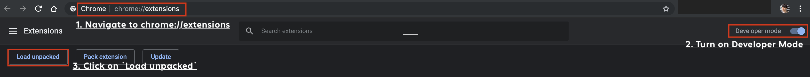

Autofill forms to Nail your RDV for TDS 🤟🏻
================================

This chrome extension fills out forms for your RDV automatically.

You only need to put values to their place, then this extension fills out a value by the query

Usage
----------------

- Put required values as string / digit in the fields
- Open the url to préfecture
- Click on the poping up middle finger 😅
- Done

##  Coverage

1. Paris (75)

## Instruction

### How to install this extension

#### 🖱 Step One.

**Download** the source code, you can either [click here](https://github.com/benbenbang/nail-rdv-tds-la-france.git), or download it by clicking on the green `Clone or Download` button

#### 🖱 Step Two.

Open Your Chrome ➜ Go to the [extensions page](chrome://extensions) ➜ Turn on `Developer Mode` on the upper right corn ➜ Click on `Load unpacked`

#### 🖱 Step Three.

Wait for the dialogue pop up ➜ Open the folder where the source code you just downloaded ➜ Go to the `src` directory ➜ **Click** on `select`

#### 🖱 Step Four.

Click on the extension icon ➜ select `Options` ➜ Type the information ➜ Navigate to the RDV page of your préfecture ➜ Et Voila🖖🏻

Change Log
----------------

- 2019-06-10 v1.0 release (version code: 1.0)

Next Steps:
----------------
- Collect urls / form attributes from other préfectures in province
- Need to find out a scalable way to handle different websites
- Move from local storage to some where else or auto clean

